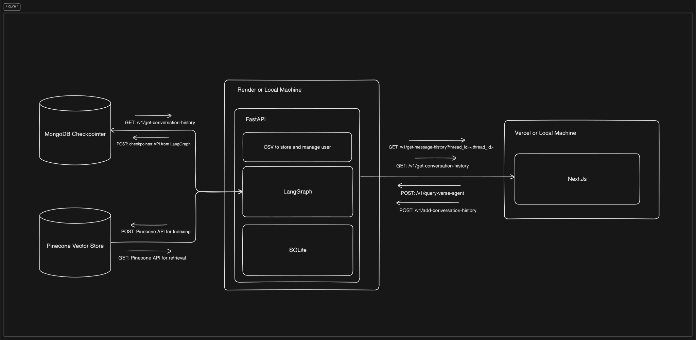
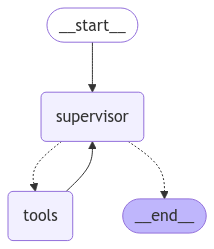
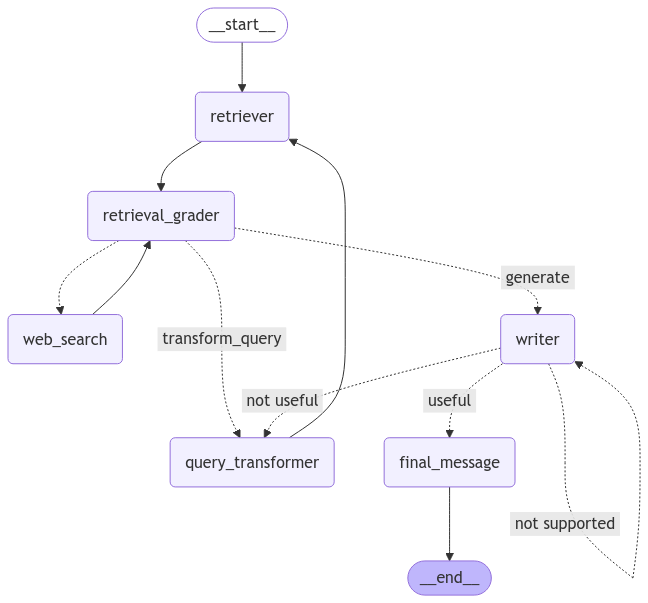
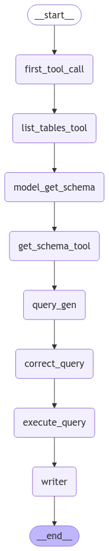

# QueryVerse: Multi-agent AI for Your Inventory

⚡ Leveraging state-of-the-art RAG technique with Text-to-SQL for Multi-Agent Workflows 💪

## Project Overview

QueryVerse is a multi-agent system which combines three specialized agents - RAG, SQL and Conversational Agent to streamline inventory analytics using natural language, making it feel like you're directly talking with your inventory.  

**The dummy SQLite has three tables Users, Orders, and Products.**

**Access the frontend from** [here](https://query-verse-nine.vercel.app/)  
**Access the backend from** [here](https://queryverse-backend.onrender.com/docs) (Swagger UI)

## What's Special?

1. **Self-reflective RAG and RAG Triads:** The RAG is not a regular RAG but is a self-reflective RAG which handles RAG evaluation triads:
   1. **Context Relevance:** Whether the retrieved document is relevant for the asked question or not.
   2. **Groundedness:** Whether the generated response is hallucination or not.
   3. **Answer Relevance:** Wether the generated response is addressing the asked question or not.
2. **Collaborative Agents:** ([best performing demonstration](https://smith.langchain.com/public/4d1a443a-e679-4c9d-b73c-282b3858628b/r)) The system is designed and implemented in such a way that to answer a complex query, all the agents can participate and handle their part in the query.  For instance, a query like **get me details of the products that Alice has purchased** would activate the SQL agent to fetch a list of products purchased by Alice followed by the RAG agent to enrich this data by generating comprehensive details for those specific products, ensuring a complete and accurate response.
3. **Threads, Continued Conversation and Chat History:** Just like ChatGPT's threads, QueryVerse also manages threads enabling continued conversation and chat history.
4. **Web Searching Capabilities:** The RAG is paired with web searching tools so that when relevant documents are not found, it leverages web search to find relevant pieces of information for robust generation.
5. **Text-to-SQL with error handling:** The Text2SQL implementation has dual level SQL query generation check paired with effective tool error handling

## Tech Stack

| Component                          | Technology   | Description                                                                 |
| ---------------------------------- | ------------ | --------------------------------------------------------------------------- |
| RAG, SQL and Conversational Agents | LangGraph    | Framework used for building the Agents                                      |
| Agent API Serving                  | FastAPI      | Framework used to build and serve APIs for agent interactions               |
| Agent Monitoring                   | LangSmith    | Tool used for tracing, monitoring, and evaluating agent outputs             |
| Web Searching                      | Tavily       | Tool used for retrieving information from the web                           |
| LLM                                | OpenAI       | Provides the language model for text generation                             |
| Front-end                          | Next.Js      | Framework for building a interactive and blazingly fast front-end interface |
| UI Components                      | NextUI       | Library for crafting sleek and reusable user interface components           |
| CSS                                | Tailwind CSS | Utility-first CSS framework for efficient styling of the front-end          |
| Indexing                           | Pinecone     | Service for vector indexing and managing the knowledge base efficiently     |
| SQL Database                       | SQLite       | Lightweight database for structured business data storage and querying      |
| Persistence / Memory / Threads     | MongoDB      | NoSQL database for managing agent memory and maintaining active sessions    |
| Front-end Deployment               | Vercel       | Platform for deploying the front-end with optimized performance             |
| Backend-deployment                 | Render       | Platform for deploying and managing the backend services                    |

## Architecture

Will update more later

1. Overview of the backend and the frontend:

2. On the top QueryVerse has the `Supervisor Agents` which facilitates collaboration across Conversational, RAG and SQL Agent. The tools in the diagram represents all the three agents.
  
3. RAG Agent:  
  
4. SQL Agent:  

## Objectives

Will update more later

## Routes

Will update more later

## How to Run Locally

To run the whole project i.e. front-end and back-end locally, you need to follow and setup both individually as shown below.

GitHub repo for the [front-end](https://github.com/Taha0229/QueryVerse)
GitHub repo for the [back-end](https://github.com/Taha0229/QueryVerse-backend)

### Steps for setting up the front-end

## Step 1: Fork and clone the frontend

Fork the repo and clone the  [frontend repo](https://github.com/Taha0229/QueryVerse) on your local machine using, so you can modify and push to your own repo/code:
`git clone <url of forked repo>`

### Step 2: Install Dependencies for the frontend

Install all the necessary dependencies for the project using the following command:
`npm i` or `npm install`

### Step 3: Configure Backed API Routes

Make a global search (or replace manually) for `https://queryverse-backend.onrender.com` and replace it with `http://127.0.0.1:8000` to point to your local `FastAPI`

### Step 3: Run the Frontend

Run using the app using `npm run dev` command.

## Steps for setting up the back-end

### Step 1: Fork and clone the backend

Fork the repo and clone the  [backend repo](https://github.com/Taha0229/QueryVerse-backend) on your local machine using, so you can modify and push to your own repo/code:
`git clone <url of forked repo>`

### Step 2: Create a python virtual environment

You can use `venv` module to create a virtual environment called dev using `python -m venv dev` command, or use your choice of method like `conda`.
Activate the virtual environment, for `venv` use the command `dev\Scripts\activate` on windows and `source dev/bin/activate` on macOS.

### Step 3: Install Dependencies for the backend

Install all the necessary dependencies for the project using the following command:
`pip install requirements/dev.txt` replace it with `pip install requirements/prod.txt` while deploying on production.

### Step 4: Setup environment variable

Create a `.env` file besides `.env.sample`
Refer `.env.sample` to create APIs for the listed services and setup them on `.env`

### Step 5: Run the backend

Use the command `fastapi dev src/main.py` or `uvicorn src.main:app --reload` to serve the `FastAPI` on `localhost` over `http://127.0.0.0:8000`
You can also directly interact with the API using Swagger UI by navigating to `http://127.0.0.0:8000/docs`

## Project Setup

## Deployment Details

The deployments are based on convenience, cost-effectiveness and easy integrations.

1. Frontend is deployed on `Vercel` using `GitHub Actions`.
2. Backend deployed on `Render` using `GitHub Actions`.
3. Threads are implemented on `MongoDB's` managed cloud service `Atlas`.
4. The SQLite instance is paired with the `FastAPI` and deployed with the backend on `Render`.
5. Vector store is implemented with `pinecone`: cloud based managed vector store service.

## TO DOs

1. Enable Streaming: will stream processing status (like navigating to RAG agent, retrieving documents, making web search) and token level response streaming (just like ChatGPT)
2. Component Loader: need to implement spinner and skeleton loaders when retrieving conversation history and message history
3. Modularity: need to remove slight redundancy and use `zustand`  for global state management
4. Improvise Indexing: recursive chunking is working great but I believe I can improvise it even further
5. Suggest More Features: connect with me on linkedin/sheikhtahmaroof or sheikhtahamaroof@gmail.com for tech discussions

## GitHub Commit Message Format

Feat– feature

Fix– bug fixes

Docs– changes to the documentation like README

Style– style or formatting change

Perf – improves code performance

Test– test a feature

Example: `git commit -m "Docs: add readme"` or `git commit -m "Feat: add chatting interface"`
